By the end of this blog post, **you will have a better understanding of
APIs and their benefits for researchers**, and moreover, you will have built your own API
wrapper, and possibly, even your own API endpoints. Most importantly, the in-depth walkthrough will hopefully help you identify APIs in the wild. **You will realize that APIs are used everywhere**, from the KOF Data API[^1], to Art Museums and COVID-19 case rates.

### Getting Data, the Naive Way

Let's go back to the initial of an economic index. How would we approach gathering data to
build our economic index?

The *Naive Way* of collecting data would be to google for relevant data.
Like in most countries, in Switzerland, the Federal Statistical Office (FSO) is a good source for information such as the GDP - the most common representation in macroeconomics for a country's economic activity.

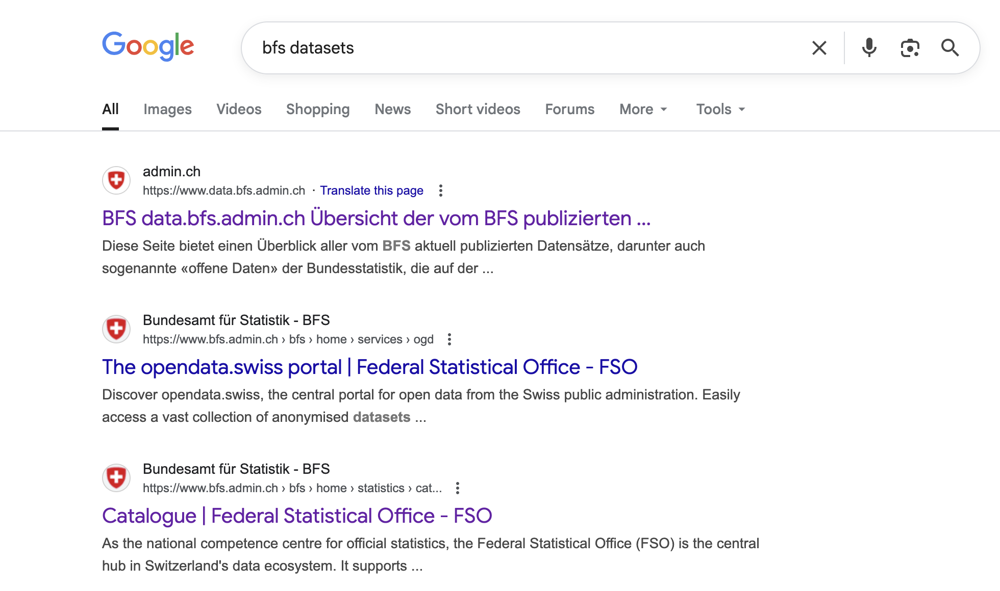

By clicking on the search result of the FSO website, we could find their *Economic Data
Portal*.

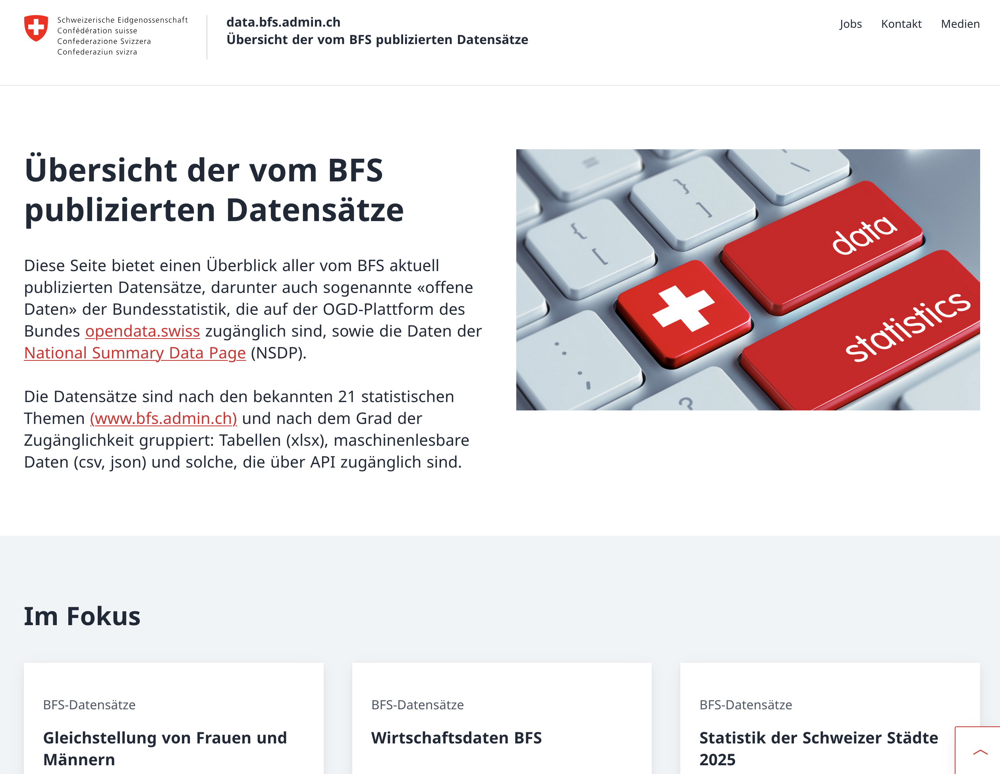

Then, after searching for our desired time series, we would find different
variations of GDP data.

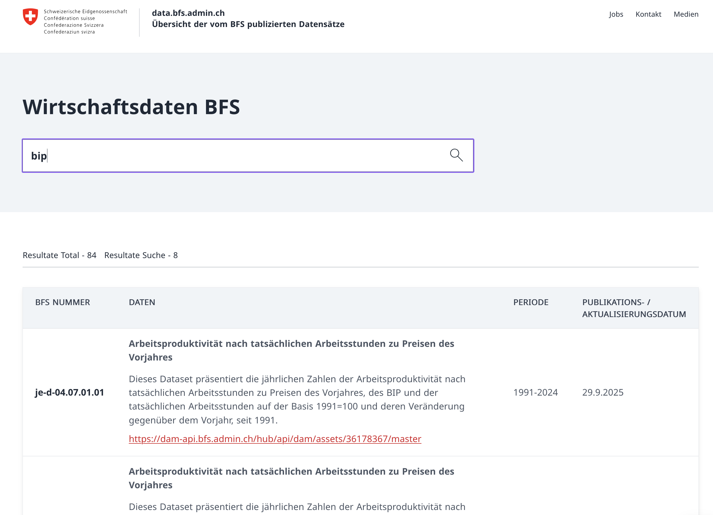

After downloading the dataset from the FSO, we can open and inspect it. The
data is typically downloaded in Microsoft Excel file format and represented in wide format (meaning values are horizontally oriented) because it is more humanly readable than other more compact  representations.

When programming though, we often prefer the so-called long format (values
vertically oriented) because it makes plotting and cleaning of data easier. Particularly
time series data is represented in this way[^2].

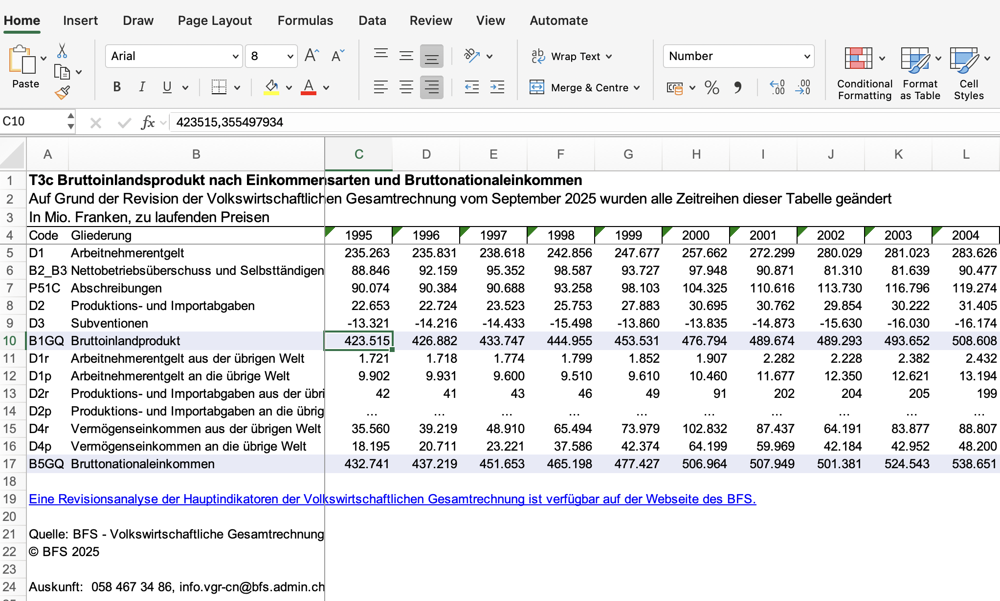

So, once downloaded, we have to transform the data from wide to long format, so it is
more handleable for us.

``` r
library(readxl)
library(magrittr)
library(tidyr)

data <- read_xlsx("je-d-04.02.01.03.xlsx")

# subset only the rows 3 (= year) and 9 (= gdp)
gdp <- data[9,]
names(gdp) <- data[3,]

# pivot data longer (from excel wide format to data frame long format)
gdp_long <- gdp %>%
  pivot_longer(
    cols = everything(),
    names_to = "Year",
    values_to = "GDP"
  )

# remove old headers
gdp_long <- gdp_long[-c(1:2),]

# check structure
# str(gdp_long)

# convert to gdp numeric and year to year
gdp_long$GDP <- as.numeric(gdp_long$GDP)
gdp_long$Year <- as.integer(gdp_long$Year)

head(gdp_long, n=10)
```

We read in our data, then select the rows which we need, which is the
aggregated GDP, and the date. Then we pivot our data (which transforms
the data from horizontally oriented to vertically oriented), and remove
old headers. Finally, we check that our data is correctly represented in
the desired format:

::: cell
::: {.cell-output .cell-output-stdout}
    # A tibble: 10 × 2
        Year     GDP
       <int>   <dbl>
     1  1995 423515.
     2  1996 426882.
     3  1997 433747.
     4  1998 444955.
     5  1999 453531.
     6  2000 476794.
     7  2001 489674.
     8  2002 489293.
     9  2003 493652.
    10  2004 508608.
:::
:::

By now, we have successfully searched for, imported and cleaned our
first time series dataset for our Economic Index.

It was quite a long and intensive process, wasn't it? We had to look for
the correct data, download, and then clean it. Given that we have
approximately 299 time series to go to build our index, this approach could become quite
unsustainable quickly --- especially if we want to repeat this process in
the future to update our index.

Moreover, while GDP is such a common dataset and hence is readily
available and published in a well known format, this might not be the case
for more niche time series. Finding, importing and cleaning other time series could
become a lot more difficult..

Hence, let's introduce a different method for extracting data from a public
source that is more repeatable, and reproducible (we want to do it using
code).

### Getting Data, the API (wrapper) Way:

The reason why APIs are preferred as data source over the *Naive Way* is that when using APIs **everything is standardized, thanks to protocols**.

API stands for Application Programming Interface, and essentially
standardizes the way in which your computer communicates with another
computer. Protocols are just explicit set of rules which need to be
followed. Most APIs use something called HTTP - which dictates how all data
transfer happens over the web. You might have already seen HTTP in your
browser (e.g. http://url...) this is because your browser on your
computer and the webserver also communicate via HTTP.

But just communicating via http:// in our browser is not enough. This
approach is still not reproducible, since we need to input the urls
every time we want to get our data. We want to find a **solution that is
reproducible and uses code**. In other words, we want our R code
to communicate with the server - so we use APIs.

#### Two important things about HTTP

There are two important things I want you to know about HTTP:

1.  it uses *client & server* and *request & response* protocols (aka
    clients request something from the server, the server sends a
    response)


2.  There are four main **HTTP request methods** used to determine the type
    of data exchange happening:

-   **GET** : retrieves data
-   **POST** : sends data
-   **PUT**: changes the data
-   **DELETE** : deletes data


#### How an API looks like: Where, How, What

Now that we focus on APIs that use the HTTP protocol, let's put it all
together to explain what an API looks like.

The **request** (which is how we communicate to the server what we want
it to do) consists of:

-   one of the HTTP request methods, such as GET (to get data) and
-   the **Where** which is Base URL, since it represents the location of
    the server.
-   the **Which service** is specified through the Endpoint, which
    dictates what the client wants to do, i.e. get data, users, etc.


-   then the **How** is specified with additional parameters. You can
    think of them like search filters. There are two main types of
    parameters:
    -   *path parameters*, like `/users/{userID}` or
    -   *query parameters* like `/users?ID=userID` (& can also be used
        to separate multiple body params)


Once a request is sent to the server, it gives back a **response**:

-   **Status**: if the request was successful or unsuccessful
-   **Response Body**: depending on the request you might get requested
    data, an acknowledgment that a resource was created or updated, an
    error message. Common formats of the response body are JSON and
    HTML.


#### Example: The Museum of Modern Art

Let's use what we've learnt to look at an example:


The Museum of Modern Art has an API which can be used to determine what
kind of artworks they have, based on certain keywords in the artworks
title.

Example URL:
<https://collectionapi.metmuseum.org/public/collection/v1/search?q=bread>

This is a GET request to the Met Museum Collection API. It consists of:

-   the base URL:
    https://collectionapi.metmuseum.org/public/collection/v1
-   the endpoint: /search
-   a query parameter: q=bread (the search keyword)

The API returns JSON containing the total number of matching objects and
an array of objectIDs for items that match the keyword. Try pasting the
URL into your browser and replace "bread" with any other keyword to see
different results.

I encourage you to try out GET API call yourself, by putting in the URL
of the Example into your browser and inputting your own search word.
Since HTTP is used on the web, we can perform the GET request via our
browser as well.


### API Wrappers

The most frequent way we as developers encounter APIs is through so
called API wrappers. You can think of them like simple programs that are
give an entrypoint through a function in your favorite programming language that takes input parameters and puts together the right API Url and request based on that input.
In other words, they wrap the API.

API wrappers usually allow you to do complex API calls in an easier
environment and are tailored to your programming language, so they are usually
the most convenient way for us to use an API.


Here is a visual example of how you might encounter an API wrapper. Notice how the functionality stays the same, we can perform the same tasks, but we see and interact with less complexity.
This is something we call information hiding.

There are many API wrappers in R that you can use for your future
analyses, to name a few:

-   the
    [kofdata](https://www.rdocumentation.org/packages/kofdata/versions/0.2.1)
    R Package (for KOF data)
-   the [BFS](https://felixluginbuhl.com/BFS/) R package (for Swiss
    federal statistics)
-   the [fredapi](https://pypi.org/project/fredapi/) Python Library (for
    US economic data)
-   the [fredr](https://sboysel.github.io/fredr/) data from the Federal
    Reserve Economic Data (FRED) API R package
-   [public-apis](https://github.com/public-apis/public-apis) a Github
    repository listing Public APIs

#### Use the BFS API Wrapper for R

Let's go back to our example of getting data from the Swiss Federal
Statistical Office (FSO). Since we have already imported and cleaned our
GDP data, we want to move on to the next relevant time series. One other
factor that could be a good predictor for economic activity in
Switzerland is energy consumption over time.

Luckily, we can use the FSO' API wrapper, which is the [BFS' R
Package](https://cran.r-project.org/web/packages/BFS/index.html) to get
our energy data.

``` r
# devtools::install_github("lgnbhl/BFS")
library(BFS)

# to inspect functions, use ?function, e.g.
?bfs_get_catalog_data

catalog <- bfs_get_catalog_data(language = "en", title = "energy")
dataset_nr <- catalog$number_bfs[1]
energy_df <- bfs_get_data(dataset_nr, lang = "en")

# filter only total energy accounts
total_energy <- subset(
  energy_df,
  # filter for totals for each of the columns
  `Economy and households` == "Economy and households - Total" &
  `Energy product` == "Energy product - Total",
  # select only the two relevant columns
  select = c(Year, `Energy accounts of economy and households`)
)

names(total_energy)[2] <- "Amount"

# View(total_energy)
head(total_energy, n=10)
```

Let's go through the code line-by-line:

First we install and load the package, then we can inspect the functions
we will use, such as `bfs_get_catalog_data` to see that we can use this
function to determine what kind of data BFS publishes, based on
keywords.

::: cell
::: {.cell-output .cell-output-stdout}
    # A tibble: 1 × 6
      title                 language number_bfs number_asset publication_date url_px
      <chr>                 <chr>    <chr>      <chr>        <date>           <chr>
    1 Energy accounts of e… en       px-x-0204… 36179320     2025-09-30       https…
:::
:::

We search for energy datasets, save the respective ID of the dataset,
and then GET the data, using the `bfs_get_data` function.

After line 9, we are already done with the API usage for this example.
The rest is just filtering the dataset to get only the columns of
interest (total Energy Product across all Economy and Households)

When inspecting the data, it looks like this:

| Year | Amount |
|------|--------|
| 2006 | 1157170 |
| 2007 | 1126804 |
| 2008 | 1158734 |
| 2009 | 1136915 |


### From API Wrappers to APIs proper

In theory, we could be done with this example - using API wrappers
instead of manually looking for data on the web makes it easier for us
to scale our example - meaning we can easily fetch our 300 time series
with little extra effort.

Still, to get a deeper understanding of how APIs work, we could also
take a look at how API Wrappers work under the hood. Luckily for us, R
packages like FSO are open source (like the R programming language) so
we can see how a function such as `bfs_get_data` is written. We can go
to the Package author's github page, and [find the
function](https://github.com/lgnbhl/BFS/blob/master/R/bfs_get_data.R)

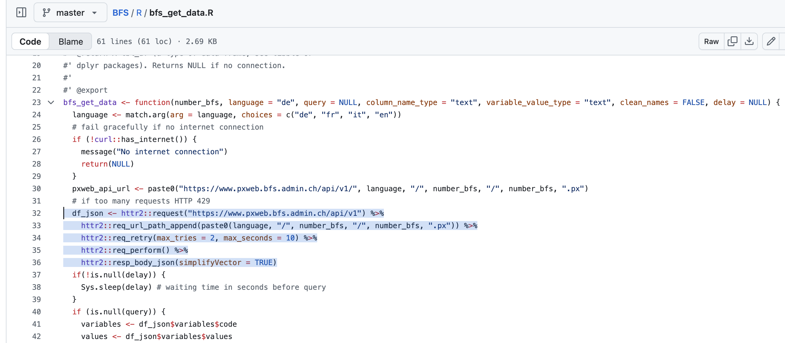

This might look a bit complex, so let's break it down by looking at the
essential code:

``` r
bfs_get_data <- function(number_bfs, language = "de", query = NULL, column_name_type = "text", variable_value_type = "text", clean_names = FALSE, delay = NULL) {
  # base url
  df_json <- httr2::request("https://www.pxweb.bfs.admin.ch/api/v1") %>%
    # add path params
    httr2::req_url_path_append(paste0(language, "/", number_bfs, "/", number_bfs, ".px")) %>%
    httr2::req_retry(max_tries = 2, max_seconds = 10) %>%
    # executre request
    httr2::req_perform() %>%
    # transform response to json
    httr2::resp_body_json(simplifyVector = TRUE)
```

```{=html}
<!-- TODO: add explanation about pxweb -->
```
In essence, the function uses the existing API to build a request, then
perform it, and save the response body.

Here, we build the request with the base URL, then append this URL with
our path parameters which are the dataset ID and the language, and then
perform the request and specify that the response body (which contains
the data) should be in JSON.

Important to mention here, is that these above functions are used to
fetch the general structure of the data, i.e. the units, and different
data categories. This information is then being used to fetch the actual
data via the px-web API which is a way of distributing data that
statistical offices like to use. In principle, we could also use the
functions presented above to get the data, and other API wrappers in R
that you can find do so.

We can also try running the final URL which we create with the above
functions (up to line 5) in our browser[^3], as we did before, to see
what the structure of our data looks like:

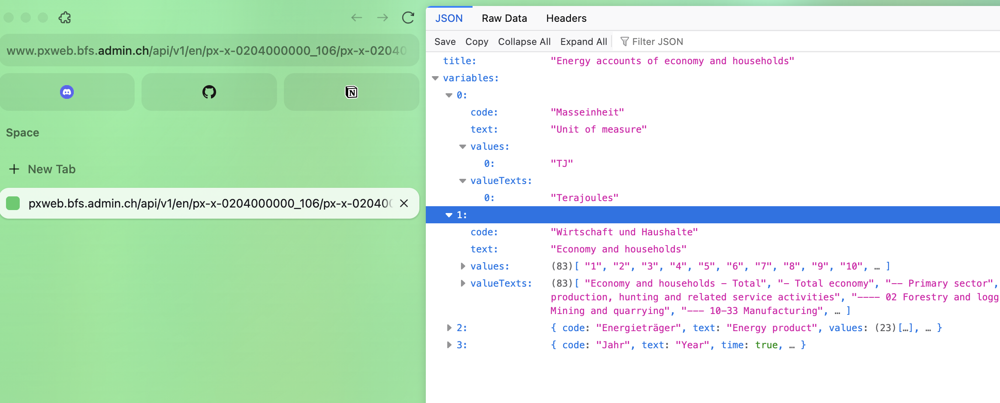

## Why APIs?

By now you might have gathered an idea about why APIs are
important and it's good practice to use them in research.

Here are some additional benefits:

-   **Consistency**: directly from the source, and up-to-date data
    (important for time series revisions)
-   **Speed and Scalability**: as seen in our example, getting hundreds
    of time series through googling and searching is not scalable or
    quick
-   **Automation**: the collection of data can be automated easily
-   **Easier to fetch data**: some data is difficult to find and the
    specification of variables or certain time frames is easier to do.
-   **APIs are used everywhere!** - Understanding how they work help you
    identify how data transfer happens

## Exercise: Your Own API Wrapper

Now that APIs have been thoroughly introduced and their importance is
clearer, try to build your own API wrapper.

Most commonly used APIs already have pre-built API wrappers, but it
could be that they are not available in your programming language of
choice, or are not maintained, or they don't exist at all. In that case,
knowing how to go about building your own API wrapper could be very
useful.

In R, the most commonly used package to work with the HTTP protocol is the [httr2
package](https://httr2.r-lib.org/) - on their website, you can find the
documentation to get started with using httr2. A short cheatsheet
summarizes the essential functions:

| Category | Function | Description |
|----------|----------|-------------|
| **Request** | `request()` | Creates a new HTTP request object that defines the endpoint and method (e.g., GET, POST). |
| **Request** | `req_perform()` | Sends the built request to the server and *returns the response object*. |
| **Response** | `resp_body_json()` | Parses the response body as JSON and returns it as an R list. |
| **Response** | `resp_status()` | Retrieves the HTTP status from the response object. |

### Build your own function wrapping the COVID API

Let's take stock of the datasets that we've gathered so far: we have
Swoss GDP and energy consumption. Now, let's say we want to look at how
the COVID pandemic has affected the Swiss Economy. To understand this
better, we would need to look at COVID case and vaccination rates.

Luckily, the [disease.sh docs](https://disease.sh/docs/) provides not
only an open API for disease-related statistics, but also nice API
documentation. We can look at various APIs and try out their endpoints!
Try it out!

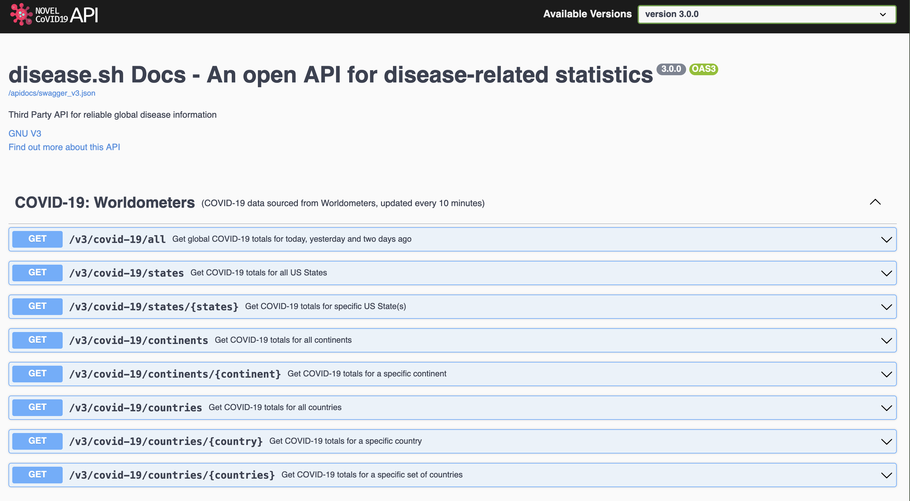

Here we can see various COVID-19 APIs, such as from Worldometer or Johns
Hopkins University.

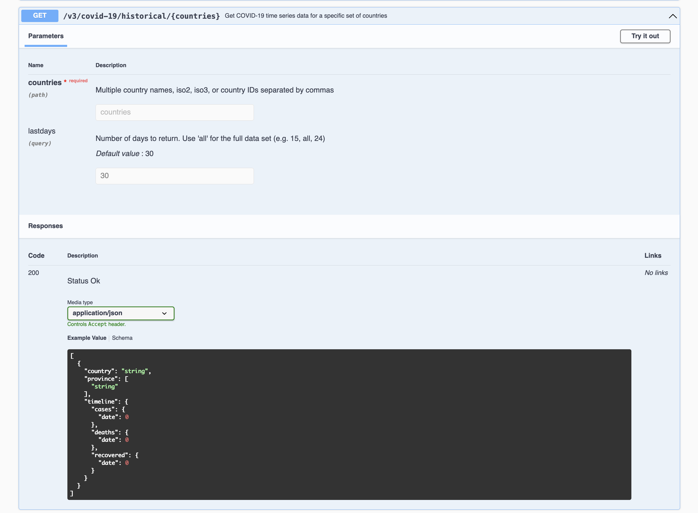

Selecting one endpoint to try out, we can identify the historical case
counts of certain countries.

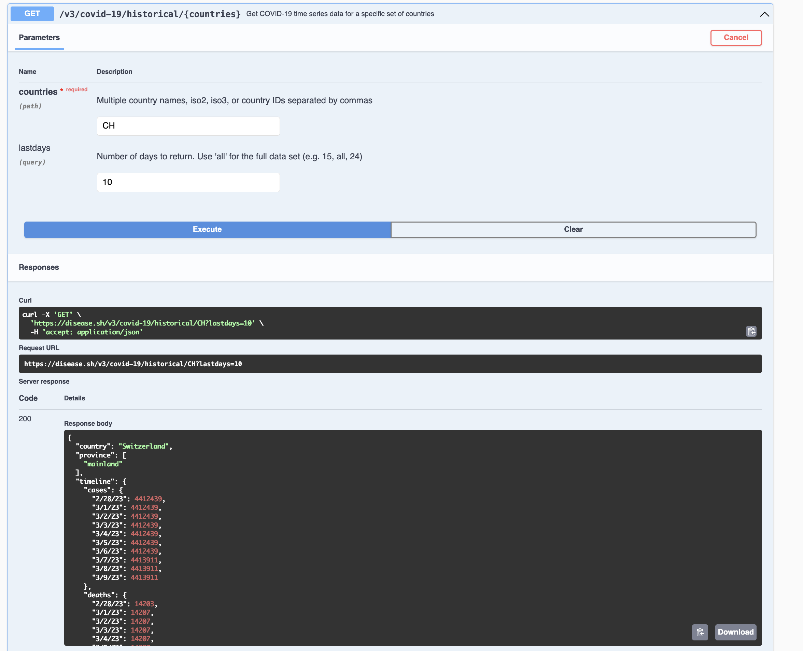

When trying out the endpoint, we can even get the data as responses, and
see all of the components of a real API call.

Let's try to turn this example into an actual function:

``` r
library(httr2)

get_case_counts <- function(country = "CH", period = c(30,365, "all")){
  # "https://disease.sh/v3/covid-19/historical/CH?lastdays=30"
  # this way is error prone, try to match.args to check if the inputs are correct
  base_url <- "https://disease.sh/v3/covid-19/historical"
  final_url <- paste0(base_url, "/", country, "?lastdays=", period)

  # perform API call with httr2
  req <- request(final_url)
  resp <- req_perform(req)

  # if request is not successful
  if (resp_status(resp) != 200){
    message("The request was not successful")
  }
  else{
    return(resp_body_json(resp))
  }
}

get_case_counts("CH", 1)
```

When running the last line `get_case_counts("CH", 1)` we get the
following output

```
    $country
    [1] "Switzerland"

    $province
    $province[[1]]
    [1] "mainland"


    $timeline
    $timeline$cases
    $timeline$cases$`3/9/23`
    [1] 4413911


    $timeline$deaths
    $timeline$deaths$`3/9/23`
    [1] 14210


    $timeline$recovered
    $timeline$recovered$`3/9/23`
    [1] 0
```


Here it's important to note that the Johns Hopkins University apparently
stopped releasing this data after 3.9.2023 and it does seem a bit
implausible that there are 0 recoveries on that day - alas!


### Your turn!

Use the same documentation as above ([disease.sh
docs](https://disease.sh/docs/)) to get the historical vaccination doses
delivered for a specific country. Try out the desired endpoint using the documentation, before writing
your own function. Feel free to use this function as a template:

``` r
library(httr2)

get_country_vaccine_counts <- function(country = "CH", period = c(30,365, "all")){

  base_url <- "..."
  final_url <- "..."

  # perform  API call with httr2
  req <- "..."(final_url)
  resp <- "..."(req)

  # if request is not successful
  if (resp_status(resp) != 200){
    message("The request was not successful")
  }
  else{
    return(resp_body_json(resp))
  }
}
```

Try out your built function! What does it return[^4] ? Congratulations on adding one more dataset to your collection for your economic indicator.


## Bonus: Build Your own API:

In case this is still not enough for you, and you not only want to know
how to use and build API wrappers, but you also want to build your
own (web) API, I've got another exercise for you.

In R, with the [plumber R package](https://www.rplumber.io/) supports
you to create your own API.
By following this exercise, you will get an even deeper understanding of what APIs do,
Plumber is a lightweight R package that turns R functions into web APIs.

For example you could use the plumber package to replicate the KOF API, which
provides users with the ability to get different public time series
data which the Swiss Economic Institute (KOF-ETH) produces and provides.

### Example: Building a KOF Barometer API - The Basic Menu

Think of building this API and its endpoints as a different service your
API restaurant offers. Or, think of it like the layers of an onion:
start simple, then add layers of functionality as needed. Begin with the
outermost, easiest layer:

-   an "Everything Please" endpoint that returns the full time series.
-   a "Custom Order" endpoint that accepts start/end parameters and uses
    a helper to slice the series, so that users only get the time series
    in the time frame they want it.

#### The "Everything Please" endpoint

-   using the `GET` HTTP request
-   fetch the complete time series using the endpoint `/data`

``` r
library(plumber)
#* Return entire KOF Barometer time series
#* @get /data
function() {
  # the partition_ts function will be explained below!
  partition_ts(data$kofbarometer)
}
```

When you run your API, you get an interactive documentation interface
(called Swagger) that looks like this:

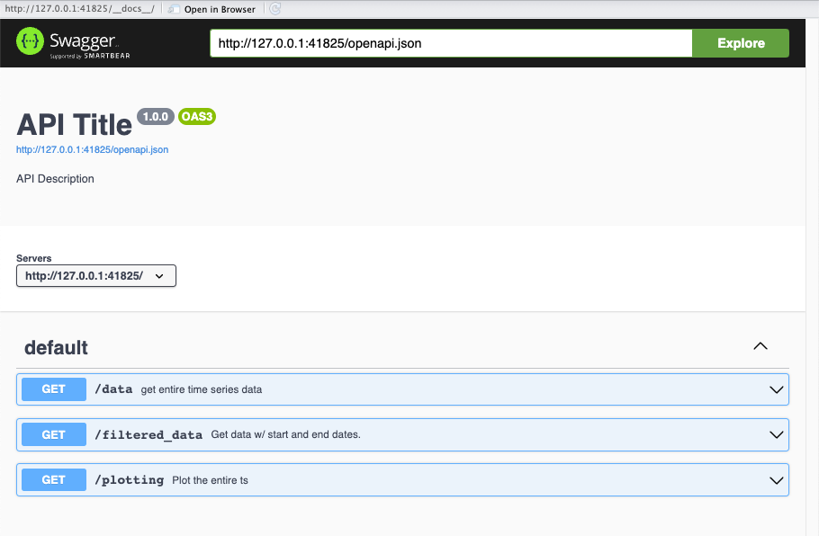

Important to note here, is that you can see 3 different endpoints here
(`/data`, `/filtered_data` and `/plotting` because those are the 3
endpoints we will create throughout this example, for now, just focus on
the endpoint we just created: `/data`)

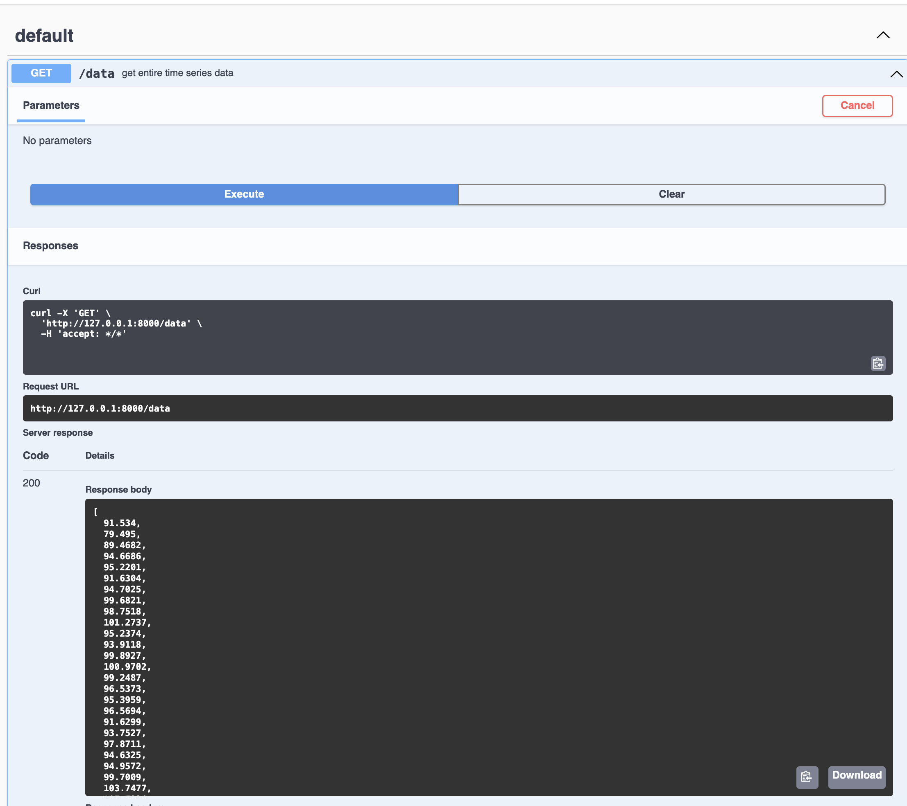

Since we just created the `/data` endpoint, see code snippet above, we
will try it out and see the Response Body, which contains the entire
Konjunkturbarometer time series.

#### Add Parameters to Your Endpoint

-   creates the endpoint `/filtered_data` which
-   lets users specify date ranges as parameters:
-   e.g.`/data?start=2020&end=2024` (Hint: these are the query
    parameters we introduced before)

For this, we first need to create a function `partition_ts` which takes
the parameters the API users pass to the endpoint, i.e. a start and end
date. We then partition the time series according to those parameters.

``` r
#* @param ts time series object
#* @param start date at which ts should start - can be years only, or c(year, month)
#* @param end date at which ts should end - can be years only, or c(year, month)

partition_ts <- function(ts, start = NULL, end = NULL) {
  if (inherits(ts, "ts")) {
    # setting start and end date if unset
    if (is.null(end)) {
      end <- time(ts)[length(ts)]
    }
    if (is.null(start)) {
      start <- time(ts)[1]
    }
    # filter ts based on start & end dates
    ts <- window(ts, start = start, end = end)
  } else {
    warning("Input is not a ts object")
    return(NULL)
  }
  return(ts)
}
```

We use the `partition_ts` function to create our new endpoint function

``` r
#* Return KOF Barometer data with custom date range
#* @param start the start year to filter by
#* @param end the end year to filter by
#* @get /filtered_data
function(start = NULL, end = NULL) {
  if (!is.null(start)) {
    start <- as.numeric(start)
  }
  if (!is.null(end)) {
    end <- as.numeric(end)
  }

  partition_ts(
    data$kofbarometer,
    start = start,
    end = end
  )
}
```

Let's create our own API that shares KOF Barometer data. We'll build
endpoints where users can:

-   using the same endpoint from above
-   Get data from specific periods: `/data?start=2020&end=2024`
-   Even get a chart: `/plot`

Let's test the `/filtered_data` endpoint by requesting KOF Barometer
data from 2010 onwards:

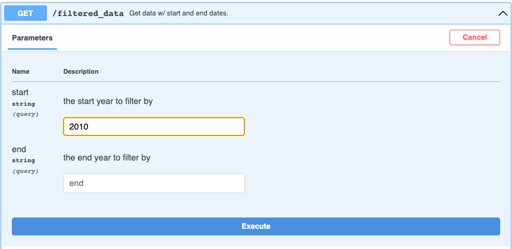

Hit "Execute" and voila---the Server response shows the exact data
requested:


#### The "Visual Takeaway" endpoint

-   we create the `/plotting` endpoint
-   using the `GET` request, we return ready-made charts:

``` r
#* Return KOF Barometer chart as PNG
#* @serializer png
#* @get /plotting
function() {
  plot(data$kofbarometer)
}
```

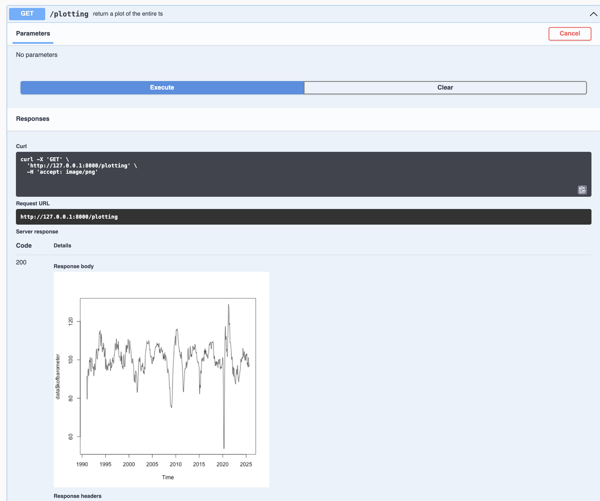

**Important to Note**: The images you see above is the API Documentation
which is automatically generated when using the plumber R package.
Swagger is your API's user-friendly interface, but behind the scenes,
your API users will interact with your API through HTTP requests, as
already shown above. In this example, a Get Request can be executed in
the browser like this:

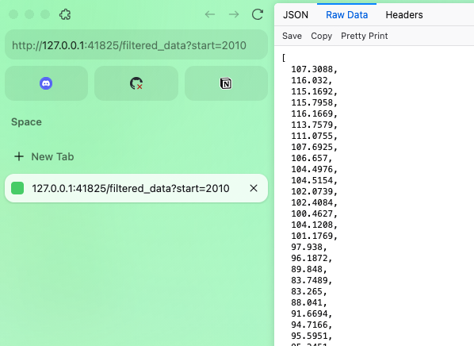

If you want to test out how to use the plumber R package to create your
own API, incl. the API documentation , then I encourage you to do so.
However, for this, consult the [plumber
documentation](https://www.rplumber.io/) and make sure to do this:

<div>

> **Testing Your API Locally**
>
> Save all three functions in a file called `plumber.R` in the base of
> your working directory, then launch your API:
>
> ``` r
> # Launch your API on port 8000
> pr("plumber.R") %>%
>   pr_run(port=8000)
> ```

</div>

Congratulations! You've just built your own API!

I hope you were able to learn something through this blog post, whether
that is how APIs and APIs wrapper work and look like, or even how to
build your own API (wrapper). Please find additional information on the HSG Data Handling Lecture on their GitHub repository[^5].  In case you have any questions, feel free
to contact me at heim [ at ] kof.ethz.ch.

[^1]: https://kof.ethz.ch/en/forecasts-and-indicators/indicators/kof-economic-barometer.html

[^2]: https://www.dontusethiscode.com/blog/2024-11-20_pandas_reshaping.html

[^3]: Try executing the Get Request yourself in your browser:
    https://www.pxweb.bfs.admin.ch/api/v1/en/px-x-0204000000_106/px-x-0204000000_106.px
[^4]: If you want to take a look at a sample solution of this task,
    check out:
    https://minnaheim.github.io/dh_guest_lecture_2025/presentation.html#/get-vaccine-rates

[^5]: HSG Data Handling Lecture repository: https://github.com/ASallin/datahandling-lecture
